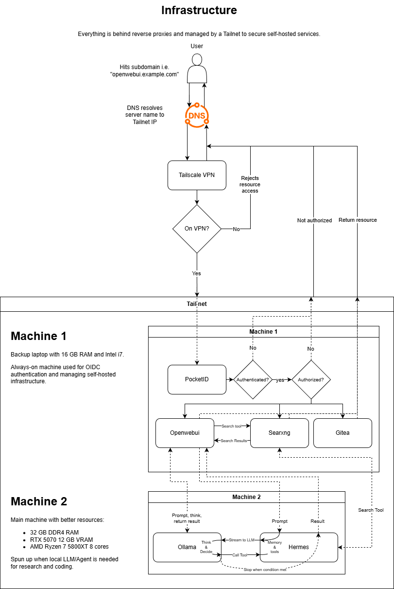

# Self-Hosted Services

A self-hosted stack running behind Tailscale with Caddy as a reverse proxy and Pocket ID as the OIDC identity provider. All services except Pocket ID are accessible only to tailnet members.

> **NOTE**
> Swap out `prokope.io` domain with one that you own and host yourself.

## Stack

| Service | Domain | Access |
|---|---|---|
| Pocket ID | `id.prokope.io` | Public (required for OIDC callbacks) |
| Gitea | `gitea.prokope.io` | Tailnet only |
| Open WebUI | `openwebui.prokope.io` | Tailnet only |
| Immich | `immich.prokope.io` | Tailnet only |
| Home Assistant | `ha.prokope.io` | Tailnet only |

## Architecture

```
Internet
  └── Cloudflare Tunnel --> Pocket ID (OIDC)

Tailnet members
  └── DNS (*.prokope.io A --> Tailscale IP)
        └── tailscale-caddy (Caddy + Tailscale sidecar)
              ├── gitea:3000
              ├── open-webui:8080
              ├── immich-server:2283
              └── 172.17.0.1:8123  (Home Assistant on host network)
```



## Prerequisites

- Docker + Docker Compose
- Tailscale account with HTTPS certificates enabled
- Cloudflare-managed domain with API token scoped to `Zone:DNS:Edit`
- Tailscale auth key (reusable)

## Setup

### 1. Clone and configure environment

Copy `.env.example` to `.env` and fill in all values:

```bash
cp .env.example .env
```

Key variables:

```env
# Tailscale
TS_AUTHKEY=                        # reusable auth key from Tailscale admin
TAILNET_SUFFIX=tailXXXXX.ts.net

# Cloudflare
CLOUD_FLARE_API_KEY_CADDY=         # Zone:DNS:Edit token for Caddy TLS
CLOUD_FLARED_API_KEY_POCKETID=     # Tunnel token for Pocket ID

# Pocket ID
APP_URL=https://id.prokope.io
ENCRYPTION_KEY=                    # generate with: openssl rand -hex 32

# Per-service DB passwords and domains
GITEA_DB_PASSWORD=
IMMICH_DB_PASSWORD=
```

### 2. Build and start

```bash
docker compose up -d
```

Caddy uses a custom build to include the Cloudflare DNS plugin for TLS certificate provisioning:

```dockerfile
FROM caddy:builder AS builder
RUN xcaddy build --with github.com/caddy-dns/cloudflare

FROM caddy:latest
COPY --from=builder /usr/bin/caddy /usr/bin/caddy
```

### 3. DNS records

Get the Caddy Tailscale IP:

```bash
docker exec -it tailscale-caddy tailscale ip -4
```

Add A records in Cloudflare for each service pointing to that IP. Set each record to **DNS only** (grey cloud, not proxied) — Cloudflare will label them "reserved IP" which is expected.

```
gitea.prokope.io      A  100.x.x.x
openwebui.prokope.io  A  100.x.x.x
immich.prokope.io     A  100.x.x.x
ha.prokope.io         A  100.x.x.x
```

### 4. Pocket ID

Pocket ID is the OIDC provider for all services. After first boot at `https://id.prokope.io`, create an admin account then register an OIDC client for each service:

| Service | Redirect URI |
|---|---|
| Gitea | `https://gitea.prokope.io/user/oauth2/pocket-id/callback` |
| Open WebUI | `https://openwebui.prokope.io/oauth/oidc/callback` |
| Immich | `https://immich.prokope.io/auth/login/oidc` |
| Home Assistant | See Home Assistant section below |

Pocket ID data is persisted at `./data/pocket-id`. Never run `docker compose down -v` as this will wipe it.

---

## Services

### Gitea

Configure OIDC under **Site Administration -> Authentication Sources -> Add OAuth2**:

- Provider: OpenID Connect
- Discovery URL: `https://id.prokope.io/.well-known/openid-configuration`
- Client ID / Secret: from Pocket ID

### Open WebUI

#### LM Studio

Connect LM Studio as an OpenAI-compatible provider under **Admin Panel -> Settings -> Connections -> OpenAI API**:

- URL: `http://<host-tailscale-ip>:11434/v1`
- API Key: any non-empty string

LM Studio must be bound to `0.0.0.0` (not `127.0.0.1`) in its server settings. To restrict access to the Tailscale interface only, bind LM Studio to the host's Tailscale IP or add a Windows Firewall rule allowing port 11434 only from `100.64.0.0/10`.

#### Kokoro TTS

Add voices from the [Kokoro voice library](https://github.com/remsky/Kokoro-FastAPI/tree/master/api/src/voices/v1_0) into `./data/kokoro/voices/`.

Configure under **Admin Panel -> Settings -> Audio**:

```
TTS Engine:   OpenAI
API Base URL: http://kokoro-tts:8880/v1
API Key:      not-needed
TTS Model:    kokoro
TTS Voice:    <voice filename without extension>
```

#### Obsidian Vault

The vault is mounted read-only at `/vault` inside the container. To index it as a knowledge base, go to **Workspace -> Knowledge -> Create Knowledge Base** and set the path to `/vault`. Configure an embedding model under **Admin Panel -> Settings -> Documents** using the embedding models served by LM Studio.

### Immich

Photos are stored at `/d/self-hosted/data/immich/upload`. The Windows Pictures folder is mounted read-only as an external library at `/usr/src/app/external/pictures`.

After first boot, register the external library under **Admin -> Libraries -> Create Library -> External Library** and set the path to `/usr/src/app/external/pictures`, then run a scan.

Configure OIDC under **Admin -> Authentication Settings -> OAuth**:

```
Issuer URL:    https://id.prokope.io
Client ID:     <from Pocket ID>
Client Secret: <from Pocket ID>
Auto Register: enabled
```

### Home Assistant

Home Assistant runs with `network_mode: host` so that it can broadcast mDNS on the local network for HomeKit device discovery. The web UI is proxied through Caddy via the host's Docker bridge gateway IP.

#### Get the bridge gateway IP

```powershell
(docker network inspect bridge | ConvertFrom-Json).IPAM.Config.Gateway
# or
docker run --rm alpine ip route | awk '/default/ { print $3 }'
```

This is typically `172.17.0.1`. Update the Caddyfile if yours differs:

```
ha.prokope.io {
    reverse_proxy 172.17.0.1:8123
}
```

#### Trust the proxy

Add the following to `./data/homeassistant/configuration.yaml` so HA accepts forwarded headers from Caddy:

```yaml
http:
  use_x_forwarded_for: true
  trusted_proxies:
    - 172.16.0.0/12
    - 192.168.1.0/24
    - 127.0.0.1
    - ::1
```

#### Apple Home / HomeKit

1. Go to **Settings -> Devices & Services -> Add Integration -> HomeKit Bridge**
2. A pairing code appears in the HA notifications sidebar
3. Scan it in the Apple Home app on iPhone or iPad

A HomePod, Apple TV (4th gen+), or iPad must be present on the same LAN as the server to act as a home hub for remote access and automations.

Open these ports on the Windows host firewall:

```powershell
New-NetFirewallRule -DisplayName "HomeKit mDNS" `
  -Direction Inbound -Protocol UDP -LocalPort 5353 -Action Allow

New-NetFirewallRule -DisplayName "HomeKit Bridge" `
  -Direction Inbound -Protocol TCP -LocalPort 21063 -Action Allow
```

#### OIDC with Pocket ID

Install HACS inside the container:

```bash
docker exec -it homeassistant bash -c "wget -O - https://get.hacs.xyz | bash"
```

Restart HA, then go to **Settings -> Devices & Services -> HACS** and search for the **OpenID Connect** integration. Follow the integration setup to connect it to Pocket ID.

---

## Data persistence

All service data is stored under `./data/` on the host:

```
data/
  caddy/              # TLS certificates
  caddy-config/       # Caddy runtime config
  gitea/              # Gitea repos and config
  homeassistant/      # HA configuration.yaml and state
  immich/
    upload/           # Immich-managed uploads (on D: drive)
    model-cache/      # ML model cache (on D: drive)
    postgres/         # Immich database (on D: drive)
  kokoro/voices/      # TTS voice files
  open-webui/         # Chat history, knowledge bases, settings
  pocket-id/          # OIDC clients, users — back this up
  postgres/           # Gitea database
  tailscale-caddy/    # Tailscale node state
```

Back up `./data/pocket-id` regularly. Losing it requires re-registering OIDC clients across every service.